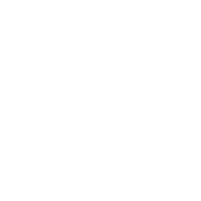
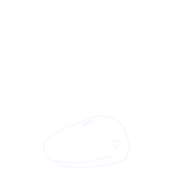

# Whale of Misfortune

**Whale of Misfortune** is an Android game inspired by *Undertale* and the classic *Hangman* game. Your goal is to guess the correct word, but every time you guess the wrong letter, you’ll remove a limb from our whale friend.

## Features

- **Interactive Gameplay**: Guess the word, but beware! Each wrong guess brings the whale closer to misfortune.
- **Unique Whale Animations**: Watch as the whale character reacts with smooth animations from many pop culture references.
- **Internationalization**: Add and guess words from multiple languages

##  How to Play

1. Start a new game and a word will be randomly selected.
2. Guess letters one by one.
3. For every wrong guess, a limb of the whale will be removed.
4. Guess the word correctly before the whale loses all of its limbs!
5. Keep track of your score in the history
6. Add or remove words in the dictionnary

##  Animations
These animations we're made by myself on Aseprite and are inspired by many references from games, anime and movies.

### Idle Animations
The whale has fun idle animations to keep it lively while you guess the word:

- **Idle Animation 1**:  
  
  
- **Idle Animation 2**:  
  

- **Idle Animation 3**:  
  

- **Idle Animation 4**:  
  

- **Idle Animation 5**:  
  

- **Idle Animation 6**:  
  


### Error Gifs

Each wrong guess removes a limb, with accompanying animations:

- **Error Animation 1** ( Undertale - Slash ):  
  
  
- **Error Animation 2** ( Dragon Ball - Kamehameha ):  
  

- **Error Animation 3** ( Portal - Portals ) :  
  

- **Error Animation 4** ( Star Wars - Lightsaber ):  
  

- **Error Animation 5** ( Jujutsu Kaisen - Hollow Purple ):  
  
  
- **Error Animation 6** ( Avengers : Infinity war - Thanos snap ) :  
  

##  Installation

1. Clone this repository:
   ```bash
   git clone https://github.com/ben4ali/android-whale-of-misfortune.git
   ```
2. Open the project in Android Studio.
3. Build and run the project on your emulator or connected devic
